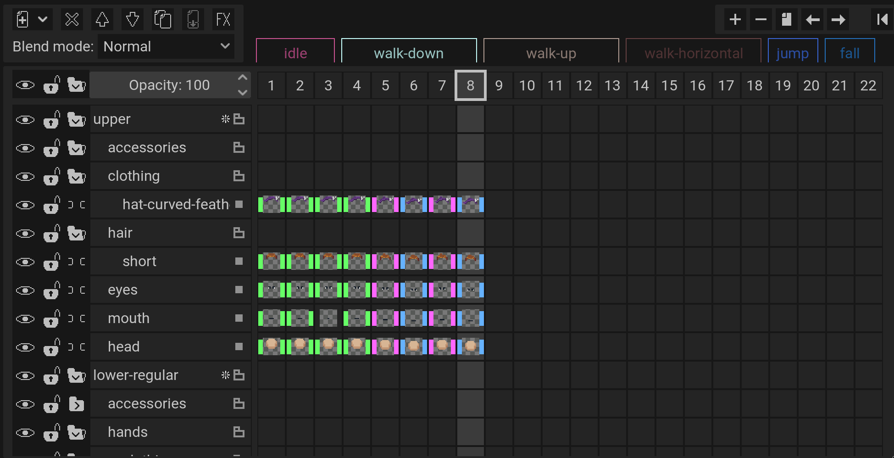
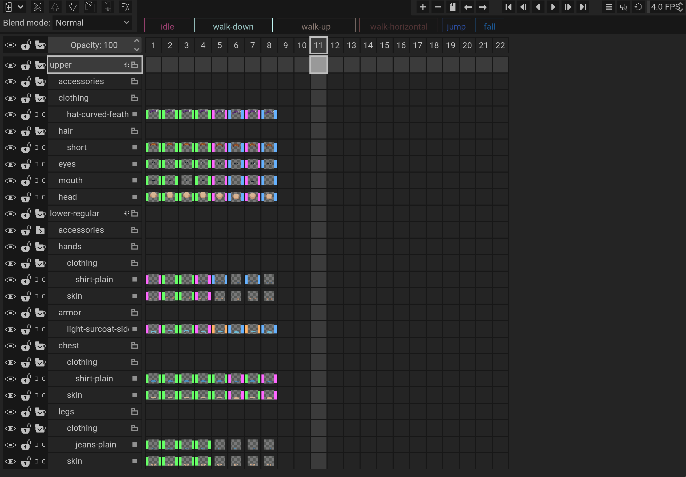

<!-- omit in toc -->
# Pixel Art

**This is not complete!**

<!-- omit in toc -->
# Table of contents

1. [Guidelines](#guidelines)
   1. [Naming](#naming)
   2. [Pixelorama](#pixelorama)
2. [Animations](#animations)
3. [Guides](#guides)
4. [Planned sprites](#planned-sprites)
   1. [Humans](#humans)
      1. [Clothing](#clothing)
   2. [Bosses](#bosses)
   3. [Animals](#animals)
   4. [Weapons](#weapons)
      1. [Weapon Tiers](#weapon-tiers)
   5. [Particles](#particles)

## Guidelines

### Naming

| Style                     | Usage                                       |
| ------------------------- | ------------------------------------------- |
| `kebab-case`A1 | files, pixelorama timeline, everything else |

- A1: `kebab-case` means separating lower case words with hyphens just like in `kebab-case`.

<figure>
  
  <figcaption>Pixelorama timeline</figcaption>
</figure>

### Pixelorama

**There is a very good guide available for Pixelorama [here](https://pixelorama.org/introduction).**

| Category                                        | Usage                                                                                                             |
| ----------------------------------------------- | ----------------------------------------------------------------------------------------------------------------- |
| Color palette                                   | Use file `apollo.gpl`B1                                                                                |
| [Layers](https://pixelorama.org/concepts/layer) | Use layering similar to the exampleB2                                                                  |
| Cels                                            | [Use `Link cels to` instead of duplicating pixels](https://pixelorama.org/concepts/cel/#linked-cels)B3 |

<figure>
  
  <figcaption>Apollo color paletteB1</figcaption>
</figure>

<figure>
  
  <figcaption>Layering exampleB2</figcaption>
</figure>

- B3: This makes working on the project in the future a lot easier since by editing a single linked cel, you can edit all.

## Animations

The following examples are meant as a general guideline of how to implement animations.

<a href ="https://www.slynyrd.com/blog/2019/10/21/pixelblog-22-top-down-character-sprites">
  <figure>
    
    <figcaption>
      Walk/Run animation exampleC1
    </figcaption>
  </figure>
</a>

- C1: The numbers in yellow/red above/below the images are the target frames. The walking animation is 4 frames and the running animation 8 frames.
- C1: Since some of these frames are repeated, only what is shown in this image needs to be drawn. Repeating the frames can be done in code.
- C1: The perspective of this character is slightly different, it uses a `3/4 perspective` and a `32x16 sprite`.

<figure>
  
  <figcaption>Unfinished example with main characterC2</figcaption>
</figure>

- C2: The first row contains an example idle animation.
- C2: The second row contains an example walk/run animation.

## Guides

Here are a few different guides that might be helpful.

- [Pixelorama](https://pixelorama.org/introduction)
- [pixelblog](https://raymond-schlitter.squarespace.com/blog)
- [pixelblog Graphical Projections 1](https://www.slynyrd.com/blog/2018/3/14/pixelblog-3-graphical-projections-1)
- [pixelblog Graphical Projections 2](https://www.slynyrd.com/blog/2018/4/12/pixelblog-4-graphical-projection-part-2)
- [pixelblog Top down tiles](https://www.slynyrd.com/blog/2019/8/27/pixelblog-20-top-down-tiles)
- [pixelblog Top down character animation](https://www.slynyrd.com/blog/2025/3/24/pixelblog-55-top-down-character-animation)
- [pixelblog Top down character sprites with 4 directional walking animation](https://www.slynyrd.com/blog/2019/10/21/pixelblog-22-top-down-character-sprites)
- [Pixel art animation](https://www.sandromaglione.com/articles/pixel-art-character-animations-guide)
- [Youtube Pixelorama guide](https://youtu.be/6srsqLhGhKk)
- [Youtube JuniperDev - Beginner to Advanced guide](https://youtu.be/DKmrBUpd0yw)

## Planned sprites

### Humans

**SPRITE SIZE:** `16x16`

<table>
  <tr>
    <th>Category</th>
    <th>TODO</th>
  </tr>
  <tr>
    <td>
      Genders
    </td>
    <td>
      <ul>
        <li>male</li>
        <li>female</li>
      </ul>
    </td>
  </tr>
  <tr>
    <td>
      Body Shapes
    </td>
    <td>
      <ul>
        <li>thin</li>
        <li>regular</li>
        <li>large</li>
        <li>strong</li>
      </ul>
    </td>
  </tr>
  <tr>
    <td>
      Animations
    </td>
    <td>
      <ul>
        <li>idle - 2 frames</li>
        <li>walk-down - 4 framesD1</li>
        <li>walk-up - 4 framesD1</li>
        <li>walk-horizontal - 4 framesD1</li>
        <li>jump-down - 2 frames</li>
        <li>fall-down - 2 frames</li>
        <li>jump-up - 2 frames</li>
        <li>fall-up - 2 frames</li>
        <li>jump-horizontal - 2 frames</li>
        <li>fall-horizontal - 2 frames</li>
      </ul>
    </td>
  </tr>
</table>

- D1: The walk in this case includes the run animation, therefore all 4 unique frames need to be drawn.

#### Clothing

<table>
  <tr>
    <th>Category</th>
    <th>TODO</th>
  </tr>
  <tr>
    <td>
      Armor (can cover whole body)D2
    </td>
    <td>
      <ul>
        <li>light cloth armor, fex. dress, cloak, cape</li>
        <li>light leather armor</li>
        <li>medium chainmail armor</li>
      </ul>
    </td>
  </tr>
  <tr>
    <td>
      ClothingD2
    </td>
    <td>
      Upper
      <ul>
      <li>hood</li>
      <li>hat</li>
      </ul>
      Arms/Chest
      <ul>
        <li>shirt</li>
        <li>dress</li>
        <li>cape</li>
      </ul>
      Legs
      <ul>
        <li>jeans</li>
        <li>leather pants</li>
        <li>leggings</li>
      </ul>
    </td>
  </tr>
  <tr>
    <td>
      AccessoriesD2
    </td>
    <td>
      upper
      <ul>
        <li>glasses</li>
        <li>eye patch</li>
      </ul>
      lower
      <ul>
        <li>belt</li>
        <li><a href="https://en.wikipedia.org/wiki/Girdle">girdle</a></li>
        <li>chain</li>
        <li>ring</li>
        <li>book</li>
      </ul>
    </td>
  </tr>
</table>

- D2: This is just meant as an inspiration. Other styles are possible and these styles can come in different variations.
- D2: Also see: [Wikipedia - English medieval clothing](https://en.wikipedia.org/wiki/English_medieval_clothing)

### Bosses

**SPRITE SIZE:** `16x16`-`64x64`

- [ ] TODO!

### Animals

**SPRITE SIZE:** `16x16`-`64x64`

- [ ] Friendly Eagle
- [ ] Evil Vulture
- [ ] TODO!

### Weapons

**SPRITE SIZE:** `16x16`

- [ ] Bows
- [ ] Polearms
- [ ] Swords
- [ ] Maces

#### Weapon Tiers

I'm not sure yet whether we should differentiate each tier only by an outline or if we should use special drawings for each. Either is a viable option.

- [ ] Low
- [ ] Medium
- [ ] High
- [ ] Legendary

### Particles

Only a single particle is ever needed, scaling of that particle and arrangement is done in code.

- [ ] Walking/Jump dust; **SPRITE SIZE:** `4x4`
- [ ] Attack dust; **SPRITE SIZE:** `4x4`
- [ ] Attack slash; **SPRITE SIZE:** `8x8` - NEEDS SPECIAL ANIMATION
- [ ] TODO!

